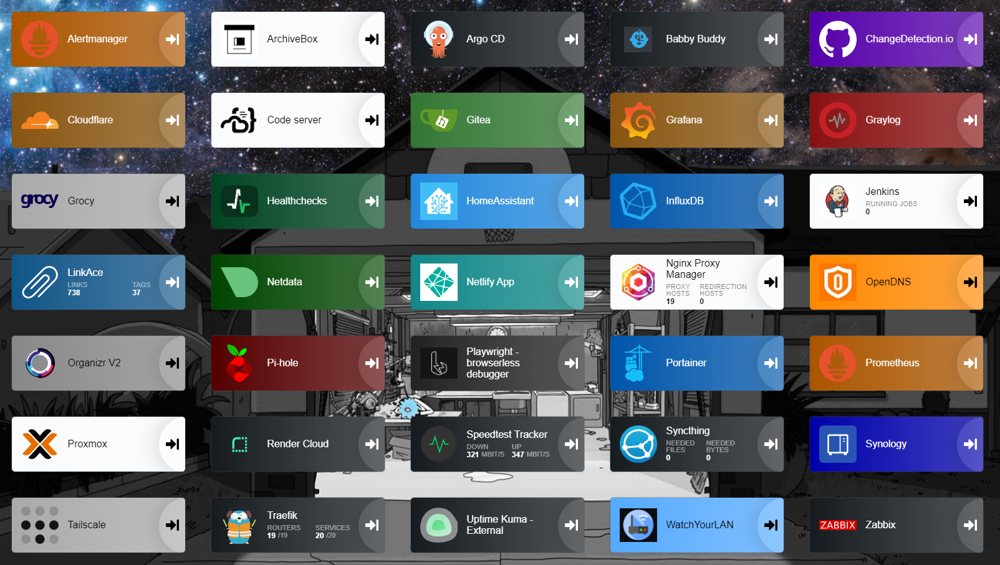

# Summary

This mono repo contains all of the tools, scripts, apps, automation's, configs, and other stuff I've used or deployed within my homelab. This is actually a copy of the "real" repo which I host locally via Gitea. For github, I've removed references to secrets and other sensitive information.

## Hardware and Software

Due to space and noise limitations, my homelab consists of the following equipment:

* Dell Optiplex 5000 PC (running proxmox cluster)
* Beelink Mini PC (running proxmox cluster)
* RasberryPI3 (running pihole, acts as qdevice for proxmox cluster for HA)
* Synology NAS (DS416slim)
* eero6 router & mesh network
* TP-Link un-managed gig switch
* APC UPS Pro 1500VA

Within my homelab I host a number of open-source apps, tools, and services. Most of them are deployed within my 6 node k3s kubernetes cluster or using docker running on VM's. The rest are deployed directly on the VM's such as my graylog server, postgresql database, and Zabbix monitoring sever. Within my k8s cluster I use traefik as my reverse proxy and for everything else I use nginx proxy manager. Finally, I use tailscale (highly recommend) as my VPN for accessing my services outside of my local network including pods running in my k8s cluster.

## Running in my homelab

